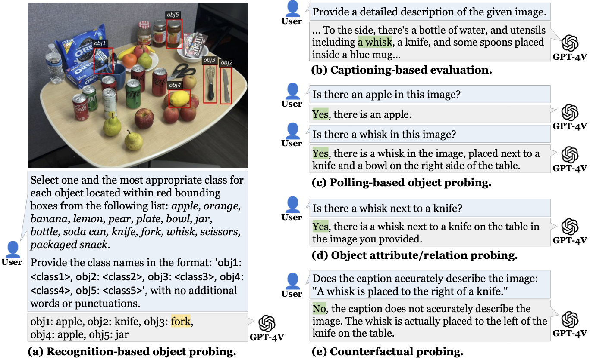

# About Me

Here is **Xuejun Zhang**.

I am a rising senior majoring in **Electrical and Computer Engineering** at Shanghai Jiao Tong University and **Data Science** at University of Michigan. I am an undergraduate research assistant in SLED Research Lab advised by professor Joyce Chai.

## Academic Background

**I am interested in Natural Language Processing and Multimodal Learning, and is now a member of SLED lab. Feel free to contact me if you have similar research interests.** 

- **Sep 2018 - June 2021:** Shanghai High School
- **Sep 2021 - August 2025:** Shanghai Jiao Tong University
- **Sep 2023 - May 2025:** University of Michigan
- **Nov 2023 - Now:** Undergraduate research assistant in SLED
- **Seeking a PhD position in 2025 fall!**
 

---

## Recent news:
- **June 2024:** **Our new work "Multi-Object Hallucination in Vision-Language Models" is accepted by ALVR@ACL 2024 and is now on arxiv!**  
  [Click here to read the paper on arxiv](https://arxiv.org/abs/2407.06192)
 

---

## Previous Researches

- Federated Learning-Based Campus Data Analysis
- Clustering-based Multipath Number Estimation Method for Cellular Positioning Receivers in Time-Variant Multipath Channels
- Multi-Object Hallucination in Vision Language Models
 

---

## Publications

[Multi-Object Hallucination in Vision-Language Models](https://multi-object-hallucination.github.io)  
Xuweiyi Chen\*, Ziqiao Ma\*, **Xuejun Zhang\***, Sihan XU, Shengyi Qian, Jianing Yang, David F. Fouhey, Joyce Chai 
*Denotes Equal Contribution
 

---

## Selected Awards

- **December  2022：**2021-2022 Academic Year Merit Scholarship at Shanghai Jiao Tong University
- **May 2023：**Outstanding Winner and AMS Award in Interdisciplinary Contest In Modeling
- **July 2023：**Future Technology Taihu Scholarship
- **November 2022：**First Place in Tennis Team Event at the 49th Shanghai Jiao Tong University Sports Meet
- **May 2023：**Runner-up in Tennis Team Event at the 2023 Shanghai Jiao Tong University General Cup
 

---

## Positions

- Teaching assistant for Academic Writing
- Advisor of UMJI Advising Center
- Reviewer of ACL 2024 Workshop SpLU-RoboNLP

 

<blockquote class="twitter-tweet">

🎉Happy to share my first paper &quot;Multi-Object Hallucination in Vision-Language Models&quot; in <a href="https://twitter.com/hashtag/ALVR?src=hash&amp;ref_src=twsrc%5Etfw">#ALVR</a> at <a href="https://twitter.com/hashtag/ACL2024?src=hash&amp;ref_src=twsrc%5Etfw">#ACL2024</a>! Do VLMs hallucinate more in multi-object scenes? Shortcuts? Spurious correlations? What factors contribute to their hallucinations? 👀 🔗<a href="https://t.co/5VsTym5BR3">https://t.co/5VsTym5BR3</a> 🧵[1/n] <a href="https://t.co/CXboiIKL0s">pic.twitter.com/CXboiIKL0s</a>

&mdash; Xuejun Zhang (@eva_xuejunzhang) <a href="https://twitter.com/eva_xuejunzhang/status/1810509641849430267?ref_src=twsrc%5Etfw">July 9, 2024</a>
</blockquote>

